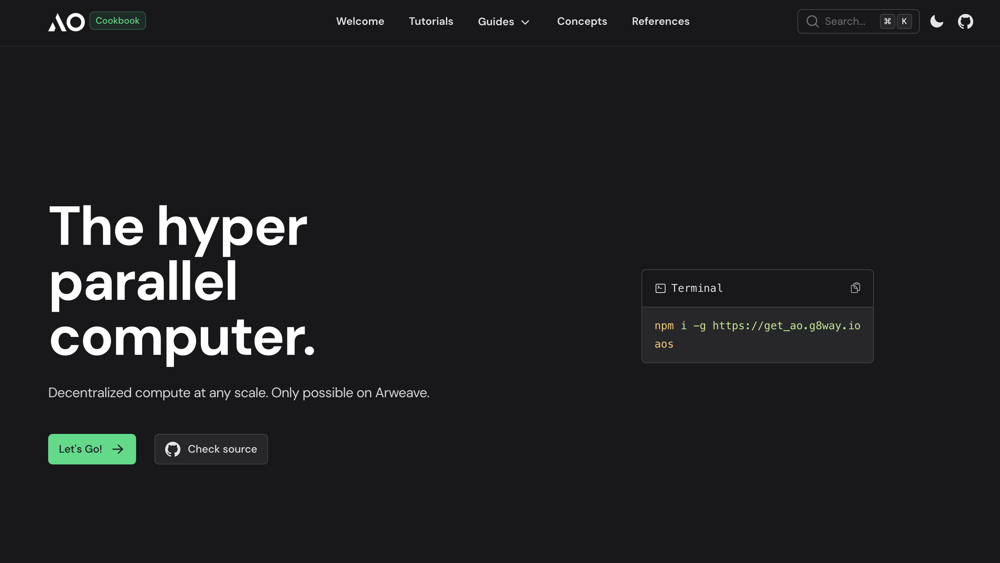

# [ao Cookbook](https://ao-cookbook.web3blog.world/)

The ao Cookbook is meant to house small digestible code snippets
for someone that has no experience with ao to be able
to grab and go.

## Difference from [ao-cookbook](https://github.com/HelloRWA/ao-cookbook)

* Move top level item to top nav
  * reduce the length of left aside menu
  * only show sub-level menu items in current top level menu
* For multiple language, I think make a different branch to host this with different sub-domain will be better.
* Support doc search internal
* Use [Nuxt3 Docs Template](https://docs-template.nuxt.dev/)
* Require to buy a [Nuxt3 UI Pro licence](https://ui.nuxt.com/pro?aff=KokMD) to deploy, it's ok to dev in localhost without licence key


## Quick Start

```bash [Terminal]
git clone git@github.com:HelloRWA/ao-cookbook-nuxt3.git
```

## Setup

Make sure to install the dependencies:

```bash
# npm
npm install

# pnpm
pnpm install

# yarn
yarn install

# bun
bun install
```

## Development Server

Start the development server on `http://localhost:3000`:

```bash
# npm
npm run dev

# pnpm
pnpm run dev

# yarn
yarn dev

# bun
bun run dev
```

## Production

Build the application for production:

```bash
# npm
npm run build

# pnpm
pnpm run build

# yarn
yarn build

# bun
bun run build
```

Locally preview production build:

```bash
# npm
npm run preview

# pnpm
pnpm run preview

# yarn
yarn preview

# bun
bun run preview
```

Check out the [deployment documentation](https://nuxt.com/docs/getting-started/deployment) for more information.

## Nuxt Studio integration

Add `@nuxthq/studio` dependency to your package.json:

```bash
# npm
npm install --save-dev @nuxthq/studio

# pnpm
pnpm add -D @nuxthq/studio

# yarn
yarn add -D @nuxthq/studio

# bun
bun add -d @nuxthq/studio
```

Add this module to your `nuxt.config.ts`:

```ts
export default defineNuxtConfig({
  ...
  modules: [
    ...
    '@nuxthq/studio'
  ]
})
```

Read more on [Nuxt Studio docs](https://nuxt.studio/docs/projects/setup).

## Renovate integration

Install [Renovate GitHub app](https://github.com/apps/renovate/installations/select_target) on your repository and you are good to go.
